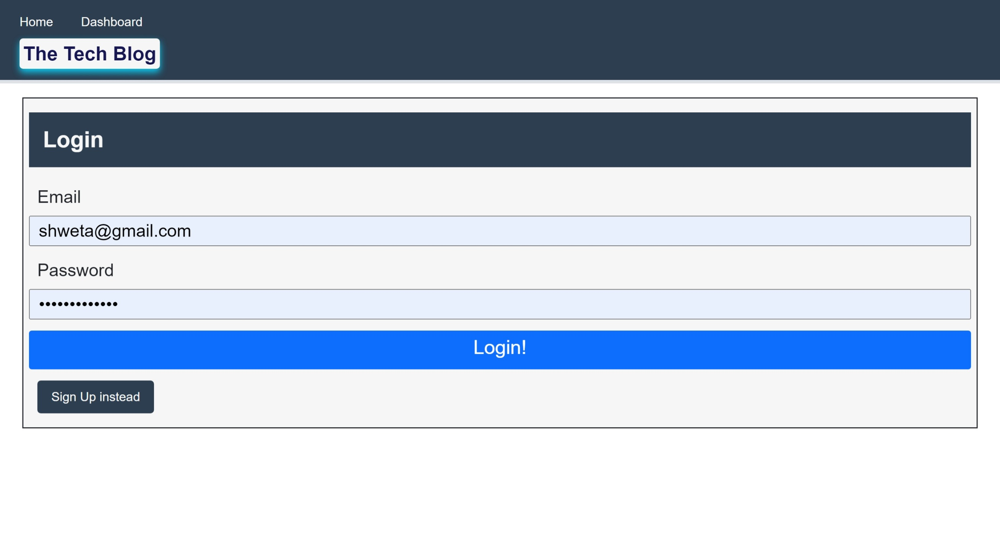
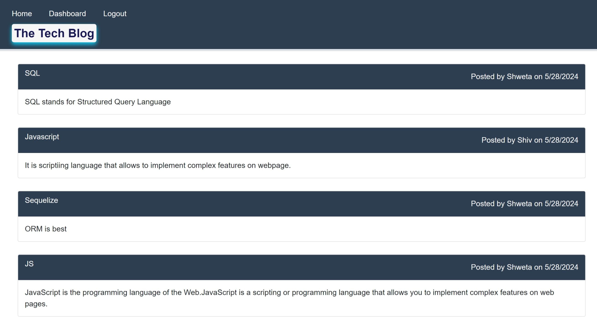
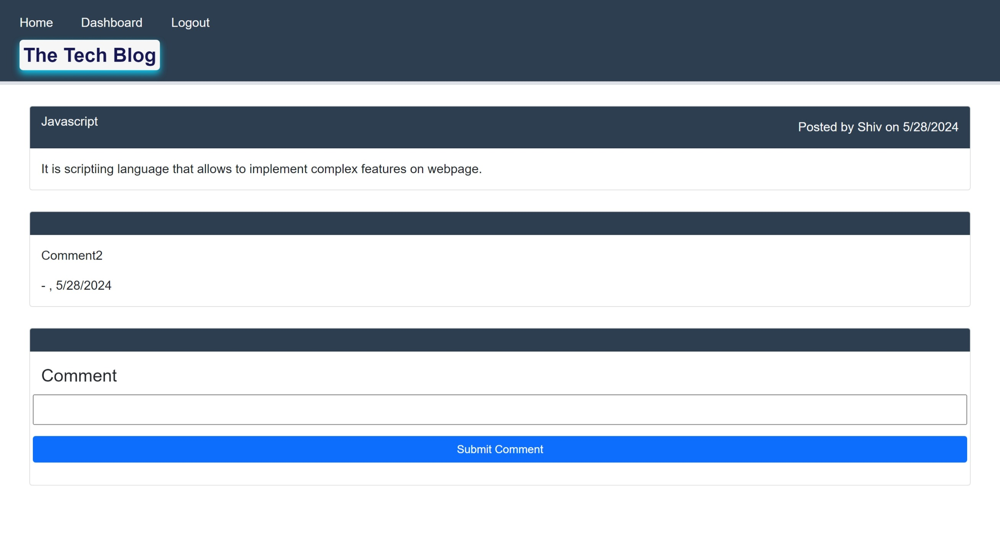
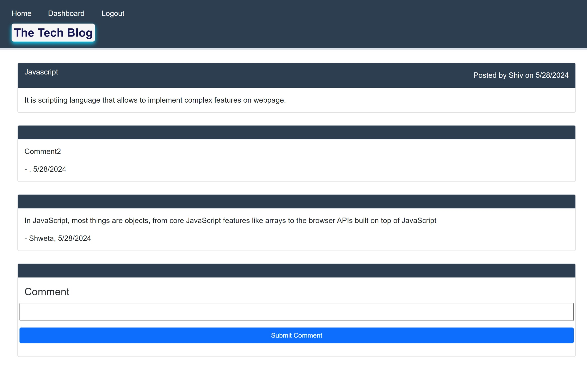
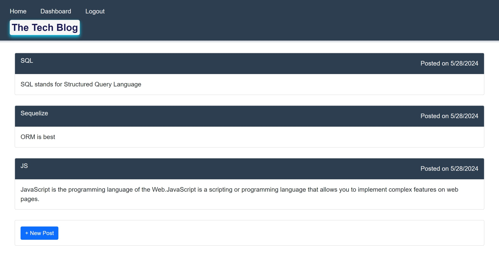
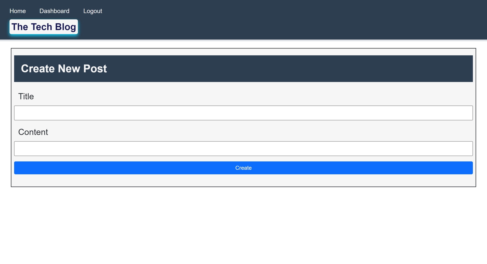
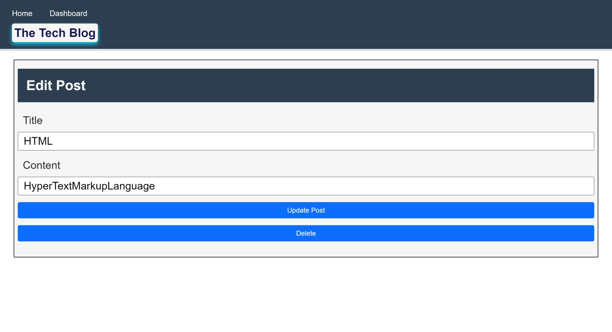
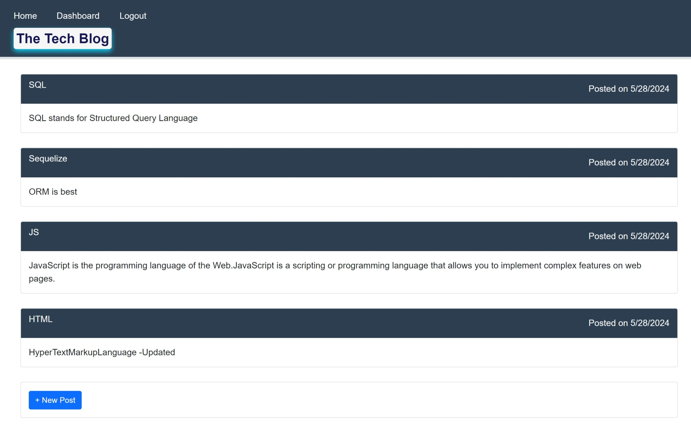
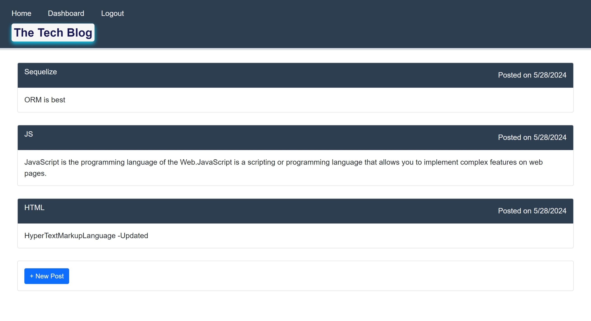
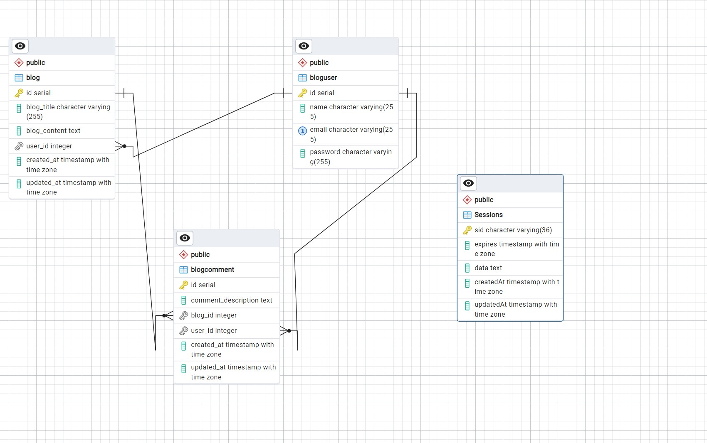

# technical-blog

## Description

- This is a CMS-style technical blog site, where developers can publish their technical blog posts and comment on other developer's posts as well.
- This project follows the MVC paradign in its architectural structure,using Handlebars.js as the templating language, Sequelize as the ORM, and the express-session npm package for authentication.
- During this implementation, I was able to apply my knowledge on MVC, Render deployment with database and Handlebars.


## Table of Contents 

- [Installation](#installation)
- [User Story](#user-story)
- [Usage](#usage)
- [Usage & Tests](#usageandtest-screenshots)
- [Acceptance Criteria](#acceptance-criteria)
- [DBSchema](#dbschema)
- [Credits](#credits)
- [License](#license)

## Installation

Follow these instructions to create your project and deploy it to GitHub Pages:

1. Create a new repository on your GitHub account and clone it to your computer.

2. When you're ready to deploy, use the git add, git commit, and git push commands to save and push your code to your GitHub repository.

3. Navigate to your GitHub repository in the browser and then select the Settings tab on the right side of the page.

4. On the Settings page, select Pages on the left side of the page. On the GitHub Pages screen, choose main in the dropdown under Branch. Click the Save button.

5. Navigate to <your-github-username.github.io/your-repository-name> and you will find that your new webpage has gone live! For example, if your GitHub username is "lernantino" and the project is "css-demo-site", then your URL would be <lernantino.github.io/css-demo-site>.

6. To ensure that the node_modules folder is not pushed in the GITHUB, the .gitignore has to be updated and included.

7. All the environment variables are added in the .env to ensure that the User credentials are confidential. A sample .env.EXAMPLE has been provided in the repository and the .env is added in the .gitignore.

8. Navigate to your Render.com - create New Web Service - Select Build and Deploy from a Git Repository

4. Connect to the respository created in above Steps 1 -2. (https://github.com/shwetakadam5/technical-blog)

5. Provide Name of the webservice : (technical-blog), Select Region : (Singapore), Branch : (main), Build Command : (npm i) , Start Command : (npm start), Auto-deploy : (Yes) , Update the DB URL (The one added on the Render.)

6. Once the settings are saved, the application is deployed and the published url will be (https://technical-blog-kee1.onrender.com/api/users/login)

## User-Story 
```
AS A developer who writes about tech
I WANT a CMS-style blog site
SO THAT I can publish articles, blog posts, and my thoughts and opinions
```
 
## Usage

**Link for the repository :** 

https://github.com/shwetakadam5/technical-blog

**Deployed application on Render URL:**
https://technical-blog-kee1.onrender.com/api/users/login


## UsageAndTest Screenshots :

#### 1. ****Technical Blog : Login:****

 

#### 2. ****Technical Blog : Home:****

 

#### 3. ****Technical Blog : View Blog (Comments):****

 

#### 4. ****Technical Blog : Submit Comment:****

 

#### 5. ****Technical Blog : Dashboard:****

 

#### 6. ****Technical Blog : Create New Post:****

 

#### 7. ****Technical Blog : Update Post :****

 

#### 8. ****Technical Blog : Updated Blog:****

 

#### 9. ****Technical Blog : Deleted Blog :****

 


## Acceptance-Criteria

```
GIVEN a CMS-style blog site
WHEN I visit the site for the first time
THEN I am presented with the homepage, which includes existing blog posts if any have been posted; navigation links for the homepage and the dashboard; and the option to log in
WHEN I click on the homepage option
THEN I am taken to the homepage
WHEN I click on any other links in the navigation
THEN I am prompted to either sign up or sign in
WHEN I choose to sign up
THEN I am prompted to create a username and password
WHEN I click on the sign-up button
THEN my user credentials are saved and I am logged into the site
WHEN I revisit the site at a later time and choose to sign in
THEN I am prompted to enter my username and password
WHEN I am signed in to the site
THEN I see navigation links for the homepage, the dashboard, and the option to log out
WHEN I click on the homepage option in the navigation
THEN I am taken to the homepage and presented with existing blog posts that include the post title and the date created
WHEN I click on an existing blog post
THEN I am presented with the post title, contents, post creator’s username, and date created for that post and have the option to leave a comment
WHEN I enter a comment and click on the submit button while signed in
THEN the comment is saved and the post is updated to display the comment, the comment creator’s username, and the date created
WHEN I click on the dashboard option in the navigation
THEN I am taken to the dashboard and presented with any blog posts I have already created and the option to add a new blog post
WHEN I click on the button to add a new blog post
THEN I am prompted to enter both a title and contents for my blog post
WHEN I click on the button to create a new blog post
THEN the title and contents of my post are saved and I am taken back to an updated dashboard with my new blog post
WHEN I click on one of my existing posts in the dashboard
THEN I am able to delete or update my post and taken back to an updated dashboard
WHEN I click on the logout option in the navigation
THEN I am signed out of the site
WHEN I am idle on the site for more than a set time
THEN I am able to view posts and comments but I am prompted to log in again before I can add, update, or delete posts
```

## DBSchema

 

## Credits

NA

## Helpful Resources

* https://coding-boot-camp.github.io/full-stack/render/deploy-with-render-and-postgresql


## License

MIT

